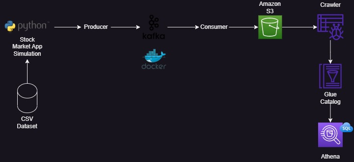

# APACHE KAFKA PROJECT - STOCK MARKET

This project was based on the video ['Stock Market Real-Time Data Analysis Using Kafka | End-To-End Data Engineering Project'](https://www.youtube.com/watch?v=KerNf0NANMo) by Darshil Parmar.

## OBJECTIVES 🎯

To simulate a real-time data processing pipeline using Apache Kafka with a local cluster using Docker containers.

## REQUIREMENTS 📄

- Docker;
- AWS account;

## DIAGRAM 📈

## STEP-BY-STEP GUIDE 👨🏻‍💻

### 1️⃣ Creating the Kafka cluster using Docker containers

1. Tutorial: [Getting Started with Apache Kafka and Python](https://developer.confluent.io/get-started/python/#introduction)

### 2️⃣ Creating the topic on the Kafka cluster

1. Inside the Kafka container:
``
kafka-topics --bootstrap-server IP_CLUSTER:PORT --topic --create TOPIC_NAME --partitions N_PARTITIONS --replication-factor N_REPLICATION_FACTOR
``

### 3️⃣ Creating the S3 Bucket

1. Tutorial: [Step 1: Create your first S3 bucket](https://docs.aws.amazon.com/AmazonS3/latest/userguide/creating-bucket.html)

### 4️⃣ Creating the producer

1. **stock-producer.ipynb** file;

### 5️⃣ Creating and running the consumer

1. **stock-consumer.ipynb** file;

### 6️⃣ Using Glue to crawl the schema of the data consumed

1. Tutorial: [How can we create a AWS Glue Crawler to Crawl on S3 Bucket?](https://stackoverflow.com/questions/76146123/how-can-we-create-a-aws-glue-crawler-to-crawl-on-s3-bucket)

### 7️⃣ Using Athena to run SQL querys on the data created

1. Tutorial: [Running SQL queries using Amazon Athena](https://docs.aws.amazon.com/athena/latest/ug/querying-athena-tables.html)
